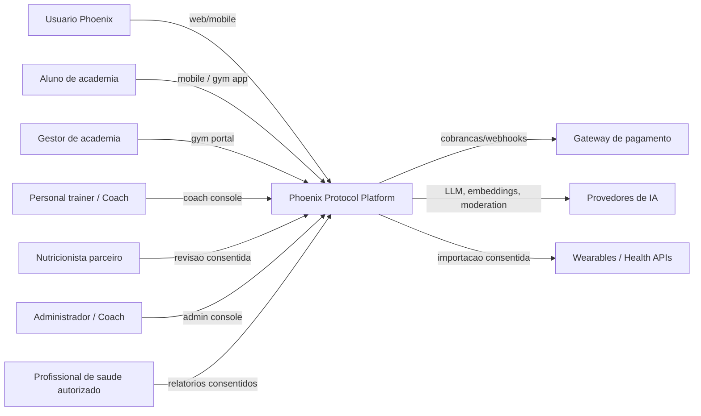
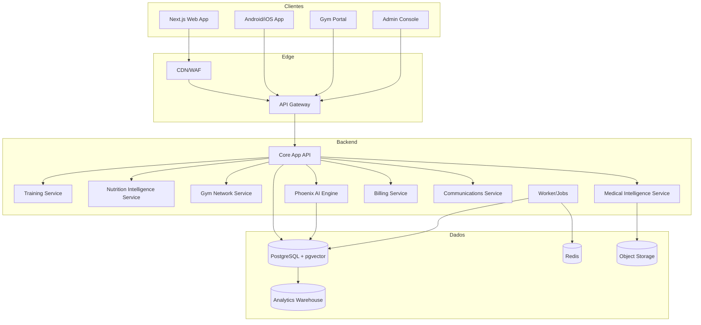

# Arquitetura Corporativa - C4 Model

## C1 - Contexto do Sistema



## C2 - Containers



## C3 - Componentes Principais

| Container | Componentes |
|---|---|
| Core App API | Tenant resolver, auth, RBAC/ABAC, user profile, consent manager, feature entitlement, audit publisher |
| Training Service | Program planner, workout engine, RPE/readiness adapter, assessment engine, challenge engine |
| Nutrition Intelligence | Protocol selector, macro target engine, carb cycling rules, meal templates, nutrition score, 14-day adjustment engine |
| Gym Network | Facility registry, member enrollment, staff permissions, cohort dashboards, gym retention signals, B2B contracts |
| Medical Intelligence | Health record vault, biomarker parser, trend analyzer, checkup reminder, consented report exporter, escalation gate |
| Phoenix AI Engine | Prompt router, context builder, RAG retriever, safety guardrail, recommendation composer, evaluation logger |
| Billing | Plans, subscriptions, invoices, entitlements, webhooks, dunning |
| Dashboard | Metric aggregator, dashboard composer, alert rule evaluator, report builder |

## C4 - Codigo e Modulos

Estrutura recomendada para um monorepo:

```text
apps/
  web/
  mobile/
  gym-portal/
  admin/
services/
  api/
  ai-engine/
  nutrition/
  gym-network/
  workers/
packages/
  domain/
  contracts/
  design-system/
  telemetry/
  security/
infra/
  terraform/
  helm/
docs/
```

## Fronteiras de Dominio

- `identity`: usuarios, tenants, consentimentos, direitos do titular.
- `training`: treinos, sessoes, progressao, desafios e avaliacoes.
- `nutrition`: protocolos Foundation/Recomp/Hypertrophy/Cut/Peak, macros, score, carb cycling, refeicoes e revisoes de 14 dias.
- `gym`: academias, unidades, alunos, equipe, cohortes, contratos B2B, dashboards e risco de churn.
- `medical`: dados de saude, exames, biomarcadores, lembretes, relatorios e regras de seguranca.
- `ai`: conversas, contexto, recomendacoes, guardrails, avaliacao e custos.
- `billing`: planos, assinaturas, entitlement e monetizacao.
- `analytics`: eventos de produto, cohorts, funis, retencao e modelos.

## Padroes Arquiteturais

- Comecar como modular monolith com fronteiras fortes; extrair servicos quando escala, seguranca ou equipe justificarem.
- Publicar eventos de dominio para acoes relevantes: treino concluido, dor reportada, ajuste nutricional aprovado, aluno matriculado em academia, exame importado, recomendacao criada, consentimento revogado.
- Isolar dados medicos com schema, politicas, auditoria e permissoes separadas.
- Aplicar idempotencia em importacoes, pagamentos, webhooks e jobs.
- Usar outbox/inbox para eventos criticos.
