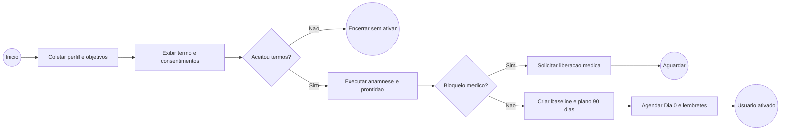
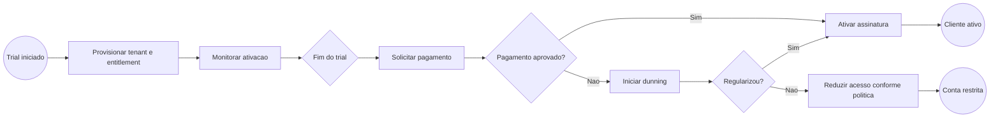

# Processos BPMN

Os fluxos abaixo seguem semantica BPMN: eventos de inicio/fim, tarefas, gateways, lanes e mensagens. Para execucao em motor BPMN, converter cada fluxo para BPMN 2.0 XML mantendo os IDs de tarefas.

## Processo 1 - Onboarding e Prontidao



## Processo 2 - Registro Diario

```mermaid
flowchart LR
  start((Dia de treino)) --> A[Usuario registra sessao]
  A --> B[Validar campos minimos]
  B --> C{Dor articular ou alerta?}
  C -->|Sim| D[Aplicar regra da dor e recomendar regressao/pausa]
  C -->|Nao| E[Calcular adesao, XP e metricas]
  D --> E
  E --> F[Atualizar dashboard]
  F --> G{Insight de IA elegivel?}
  G -->|Sim| H[Gerar recomendacao informativa com guardrails]
  G -->|Nao| I[Finalizar log]
  H --> I
  I --> end((Fim))
```

## Processo 3 - Phoenix Medical Intelligence

```mermaid
flowchart LR
  start((Novo dado de saude)) --> A[Confirmar consentimento valido]
  A --> B{Consentimento existe?}
  B -->|Nao| stop((Bloquear processamento))
  B -->|Sim| C[Importar documento ou biomarcador]
  C --> D[Classificar e extrair dados]
  D --> E[Comparar com historico e faixas de referencia]
  E --> F{Risco ou valor critico?}
  F -->|Sim| G[Gerar alerta informativo e sugerir profissional]
  F -->|Nao| H[Atualizar tendencia longitudinal]
  G --> I[Registrar auditoria e limitar linguagem]
  H --> I
  I --> end((Relatorio disponivel))
```

## Processo 4 - Assinatura SaaS



## Processo 5 - Academia e Nutrition Hypertrophy

```mermaid
flowchart LR
  start((Aluno entra pela academia)) --> A[Validar tenant, unidade e contrato B2B]
  A --> B[Convidar aluno e coletar consentimentos]
  B --> C[Registrar objetivo: recomposicao, hipertrofia, definicao ou peak]
  C --> D[Coletar medidas, treino, sono, digestao, restricoes e exames opcionais]
  D --> E{Criterio clinico sensivel?}
  E -->|Sim| F[Enviar para revisao de nutricionista/medico autorizado]
  E -->|Nao| G[Selecionar protocolo nutricional]
  F --> G
  G --> H[Gerar macros, refeicoes, carb cycling e score]
  H --> I[Executar por 14 dias]
  I --> J[Revisar peso, cintura, forca, sono e score]
  J --> K{Decisao}
  K -->|Tudo alinhado| L[Manter plano]
  K -->|Estagnado sem cintura subir| M[Adicionar 25-40 g carbo/dia]
  K -->|Cintura sobe rapido| N[Retirar 20-30 g carbo ou pequena porcao de gordura]
  K -->|Sono/humor/forca pioram| O[Reduzir deficit ou semana de manutencao]
  L --> end((Continuar ciclo))
  M --> end
  N --> end
  O --> end
```
