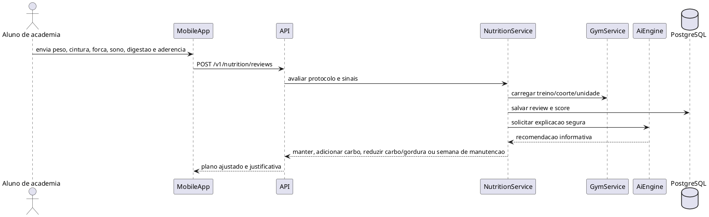
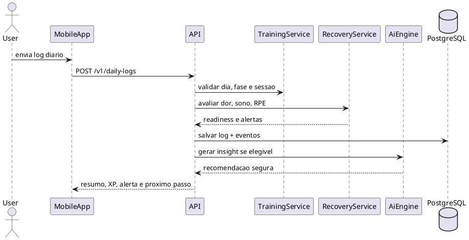
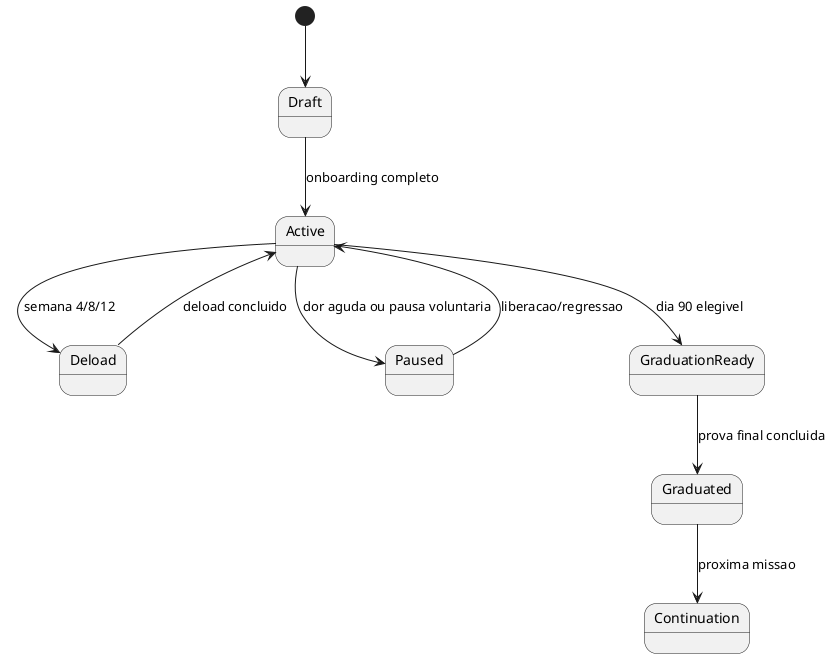
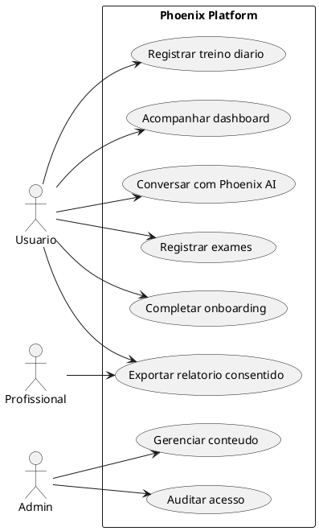

# Diagramas UML

## Diagrama de Classes - Core

```plantuml
@startuml
class Tenant { +id +name +status }
class UserAccount { +id +email +status }
class UserProfile { +birthDate +sex +timezone }
class ConsentRecord { +purpose +status +grantedAt +revokedAt }
class ProgramPlan { +phase +startDate +endDate }
class WorkoutSession { +dayNumber +rpe +completedAt }
class DailyLog { +waterLiters +sleepHours +mood +notes }
class GymFacility { +id +name +status }
class GymMemberEnrollment { +id +startDate +status }
class NutritionProtocol { +code +objective +safetyBoundary }
class MealPlan { +calorieTarget +proteinTarget +reviewCadence }
class NutritionScore { +score +tier +calculatedAt }
class FourteenDayNutritionReview { +weightTrend +waistTrend +strengthTrend +decision }
class PhysicalAssessment { +assessmentDay +performedAt }
class MedicalProfile { +riskLevel +lastReviewAt }
class AiRecommendation { +type +confidence +safetyLevel }

Tenant "1" -- "*" UserAccount
UserAccount "1" -- "1" UserProfile
UserAccount "1" -- "*" ConsentRecord
UserAccount "1" -- "*" ProgramPlan
ProgramPlan "1" -- "*" WorkoutSession
WorkoutSession "1" -- "0..1" DailyLog
GymFacility "1" -- "*" GymMemberEnrollment
UserAccount "1" -- "*" GymMemberEnrollment
UserAccount "1" -- "*" MealPlan
NutritionProtocol "1" -- "*" MealPlan
MealPlan "1" -- "*" NutritionScore
MealPlan "1" -- "*" FourteenDayNutritionReview
UserAccount "1" -- "*" PhysicalAssessment
UserAccount "1" -- "0..1" MedicalProfile
UserAccount "1" -- "*" AiRecommendation
@enduml
```

## Sequencia - Revisao Nutricional de 14 Dias



## Sequencia - Registro Diario



## Estado - Ciclo de Programa



## Casos de Uso


