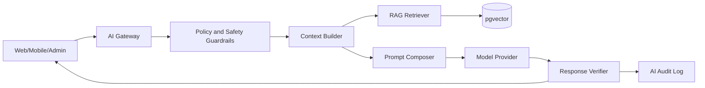

# Phoenix AI Engine

## Objetivo

Fornecer inteligencia contextual para orientar treinamento, recuperacao, nutricao, disciplina e leitura informativa de dados, sem substituir profissionais de saude.

## Arquitetura

## Capacidades

- Coach de treino: explica sessao, cadencia, progressao e regressao.
- Coach de recuperacao: interpreta sono, RPE, humor e dor como sinais de ajuste.
- Coach nutricional: sugere estrutura alimentar conforme metas e restricoes.
- War Room insights: resume tendencias e pontos de atencao.
- PMI informativo: organiza exames, graficos e perguntas para profissional.
- Admin assistant: ajuda equipe a criar conteudo e revisar cohortes.

## Guardrails

- Nunca diagnosticar, prescrever medicamento ou substituir avaliacao medica.
- Diante de dor no peito, tontura, falta de ar desproporcional, perda de consciencia ou sinais criticos, orientar parada e busca de atendimento.
- Usar linguagem de probabilidade e educacao, nao certeza clinica.
- Citar origem interna quando usar plano, manual, diario ou exames.
- Registrar prompt, contexto minimo, resposta, modelo, custo, latencia e decisao de seguranca.
- Aplicar filtro de privacidade antes de enviar contexto para qualquer provedor.

## Contexto Permitido

| Tipo | Permitido? | Observacao |
|---|---:|---|
| Plano de treino | Sim | Necessario para coaching operacional. |
| Diario de sono/RPE/humor | Sim | Usar dados recentes e agregados. |
| Exames e biomarcadores | Sim, com consentimento explicito | Usar linguagem informativa e limites medicos. |
| Dados de pagamento | Nao | Apenas entitlement abstrato. |
| Dados de terceiros | Nao | Bloquear sem consentimento e finalidade. |

## Avaliacao

- Testes de regressao por prompt.
- Golden set para perguntas de seguranca, dor, exames e progressao.
- Revisao humana de respostas de alto risco.
- Metricas: taxa de escalonamento, violacoes de policy, feedback negativo, latencia, custo por usuario ativo.
- Red team trimestral para jailbreak, aconselhamento medico indevido e vazamento de dados.
