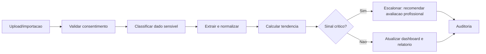

# Phoenix Medical Intelligence

## Posicionamento

Phoenix Medical Intelligence (PMI) e um modulo de inteligencia informativa para organizar dados de saude, exames, lembretes, graficos e relatorios. Nao e dispositivo medico, nao realiza diagnostico e nao substitui profissional habilitado.

## Funcionalidades

- Historico longitudinal de exames e biomarcadores.
- Avaliacoes periodicas e lembretes de check-up.
- Graficos de evolucao e comparacao com faixas de referencia cadastradas.
- Relatorios executivos para usuario e profissional autorizado.
- Recomendacoes informativas e perguntas sugeridas para consulta.
- Alertas de seguranca para procurar avaliacao profissional quando houver sinais de risco.

## Dados

- Dados coletados diretamente pelo usuario.
- PDFs/imagens de exames enviados pelo usuario.
- Integrações consentidas com HealthKit, Google Fit, wearables e laboratorios quando disponivel.
- Metadados de fonte, data de coleta, unidade, faixa de referencia e confianca de extracao.

## Fluxo de Segurança

## Requisitos Regulatorios

- LGPD: dados de saude sao dados pessoais sensiveis e exigem base legal, finalidade, seguranca, transparencia e direitos do titular.
- GDPR readiness: dados de saude tem categoria especial e exigem protecoes reforcadas quando houver residentes da UE.
- HIPAA readiness: se a plataforma atuar como business associate de covered entities nos EUA, exigir BAA, controles de ePHI, breach notification e safeguards.

## Linguagem Permitida

- Permitido: "seu resultado esta acima da faixa de referencia informada pelo laboratorio; considere conversar com um profissional de saude."
- Proibido: "voce tem X doenca", "pare medicamento", "inicie tratamento", "nao precisa procurar medico".
- Obrigatorio: contexto, fonte, data do exame, limite informativo e recomendacao de acompanhamento profissional quando aplicavel.
