# DevOps e CI/CD

## Branching

- `main`: sempre deployable.
- `feature/*`: desenvolvimento.
- `release/*`: estabilizacao quando necessario.
- Tags semanticas para releases.

## Pipeline

```mermaid
flowchart LR
  commit[Commit/PR] --> lint[Lint + format]
  lint --> test[Unit tests]
  test --> contract[API contract tests]
  contract --> security[SAST/Deps/Secrets/IaC]
  security --> build[Build containers]
  build --> deployStaging[Deploy staging]
  deployStaging --> e2e[E2E + smoke]
  e2e --> approval[Approval prod]
  approval --> deployProd[Blue/green or canary]
  deployProd --> monitor[Monitor SLO]
```

## Gates

- Cobertura minima por pacote critico.
- Sem vulnerabilidades criticas conhecidas.
- Sem segredo em commit.
- Migrations testadas com rollback.
- OpenAPI/GraphQL validos quando contratos mudarem.
- Smoke tests de login, diario, treino, dashboard, IA e billing.

## Observabilidade

- Trace ID em toda requisicao.
- Logs JSON com tenant, user hash, request id, modulo e severidade.
- Metricas: latencia, erro, throughput, custo IA, filas, webhooks.
- Alertas: erro 5xx, login failure spike, billing webhook failure, medical access anomaly.

## Release

- Canary para backend.
- Feature flags para modulos novos.
- Rollback automatico quando SLO de erro/latencia rompe.
- Post-release check em ate 30 minutos.
